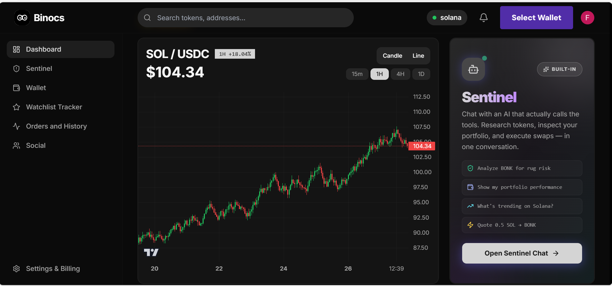
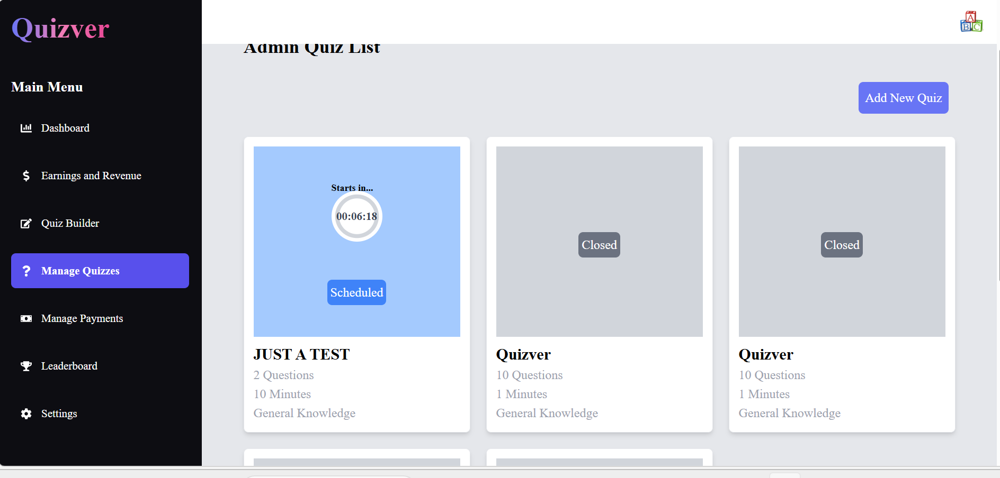
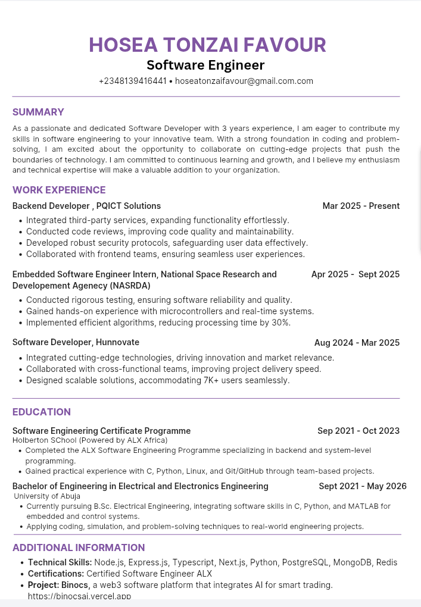

# Hosea Tonzai Favour
Backend Engineer focused on building scalable backend systems, intelligent platforms, and production-ready APIs.

  

  

# Table of Contents

- [About Me](#about-me)
- [Featured Projects](#featured-projects)
- [Technical Skills](#technical-skills)
- [Resume](#resume)
- [Contact](#contact)

---

## About Me

I am a backend engineer passionate about building reliable systems, scalable APIs, and intelligent software products that solve real-world problems.

My experience spans backend development, AI-powered platforms, distributed systems, and startup engineering. I enjoy designing clean architectures, building production-ready services, and working on products that demand both technical depth and practical execution.

I am currently focused on backend engineering, distributed systems, AI infrastructure, and long-term research in space systems engineering.

---

 # Featured Projects

---

## 1. BinocAI

  

AI-powered trading intelligence platform for token analysis, insights, and decision support.

###  Tech Stack

  
  
  
  
  

- WebSockets
- TailwindCSS
- Solana Wallet Adapter
- OpenAI API
- Birdeye API

### Overview

BinocAI is an AI-driven trading assistant that combines market data, sentiment analysis, and blockchain integrations to help users make informed trading decisions in real time.

### Key Features

- SentinelAI intelligent trading assistant
- AI-powered token analysis and insights
- Social + technical market analysis
- Real-time trading signals
- Watchlists with automated alerts
- Wallet integration (Solana)
- Market intelligence dashboard
- Chat-based analysis system

### Role

Developer and system engineer responsible for core platform implementation.

### Links

- 🔗 Live App: https://binocsai.vercel.app

---
---

## 2. BeGe Backend API

  

Backend architecture and API system for a multi-service ride-hailing platform built for a startup.

### Tech Stack

  
  
  
  

- Socket.IO
- Cloudinary
- Paystack

### Overview

BeGe is a scalable backend system powering ride-hailing, package delivery, e-commerce, and subscription-based services.

### Key Features

- Multi-role authentication and authorization system
- Real-time ride tracking via WebSockets
- Ride-hailing dispatch system
- Package delivery workflow engine
- E-commerce module integration
- Subscription and billing system
- Payment processing via Paystack
- Background job queue system
- High-performance caching with Redis

### Role

Sole backend engineer responsible for full system design and implementation.

### Links

- 🔗 API Docs: https://begeapp-backend.onrender.com/docs

---
---

## 3. Quizver

  

Real-time competitive quiz platform built for live user engagement and reward-based competitions.

###  Tech Stack

  
  
  
  

- Socket.IO
- Payments Integration

### Overview

Quizver is a multiplayer quiz system supporting real-time gameplay, scoring, anti-cheat detection, and reward distribution.

### Key Features

- Real-time multiplayer quiz sessions
- Live leaderboard system
- Anti-cheat detection engine
- Notification system for live events
- Payment and reward payout system
- User authentication and session handling

### Results

- Successfully supported 80+ active users during deployment

### Role

Full-stack backend developer responsible for system architecture and implementation.

### Links

- 🔗 Live App: https://quizver.onrender.com

---

# Technical Skills

---

## Backend Development

  
  

- Node.js
- Express.js
- REST API Architecture
- Authentication & Authorization
- Real-time Systems (WebSockets)
- Queue-based Processing

---

## Frontend Development

  
  
  
  

- React.js
- Next.js
- TypeScript
- TailwindCSS

---

## Databases

  
  
  
  

- MongoDB
- PostgreSQL
- MySQL
- Redis (Caching & Queues)

---

## Infrastructure & Tools

  
  

- Cloudinary (Media Storage)
- WebSockets (Real-time systems)
- API Documentation (Swagger/OpenAPI)
- System Design Fundamentals

---

## AI & Intelligent Systems

  

- OpenAI API Integration
- Intelligent analysis systems (BinocAI)

---

# Resume

  

  

---
# Contact

I am open to software engineering opportunities, freelance projects, and remote collaborations focused on building scalable and impactful software systems.

If you are hiring for a Backend Software Engineer role or working on an interesting product, feel free to reach out.

  

  

---
